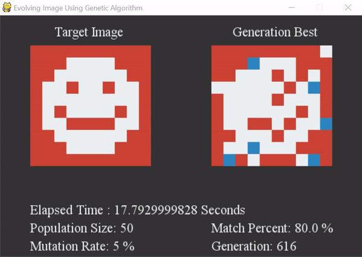

## Genetic-Algorithm

In computer science and operations research, a genetic algorithm is a metaheuristic inspired by process of natural selection that belongs to the larger class of evolutionary algorithms. Genetic Algorithms are commonly used to generate high-quality solutions to optimization and search problems by relying on bio-inspired operators such as mutation, crossover and selection.

# The Algorithm

  - **Step 1**: Creating a population. To evolve the required result, you first need a population to start with. The initial population is created with randomly generated DNA.
  - **Step 2**: Selection of the fittest. From the given population, calculating their fitness based on the fitness function you decide.
  - **Step 3**: Reproduction and Mutation.
     1. Selecting two parents according to the fitness function i.e., the parent with higher fitness is more likely to be picked than the one with low fitness.
     2. Crossover: creating a child DNA from the two parent DNAs
     3. Mutation: Mutate the child population based on mutation rate.

  - **Step 4**: Replacing the old population with new population and the cycle continues!

Generation over generation, the population gets “smarter” and “more close to the desired result”. Mutation rate should be in controlled use, i.e., if mutation rate is too high, it will generate way too much randomness and won’t lead us to the desired result, also if too low, it will not be able to generate required randomness and may lead to create exact copies of all the species in the population.

# Some Examples or Applications of Genetic Algorithm
  - [Evolving Images or Patterns](Evolving-Image-Pattern/) Here is a small demo: 
  
  
  

  
  - [Explorers](Explorers/) Demo on YouTube: [Explorers Using Genetic Algorithm](https://www.youtube.com/watch?v=0AhEp3LAq1Q&t=0s)
  - [Shakespeare-Monkey Problem](Shakespeare-MonkeyProblem/) Here is a small demo:
  
  
  

  
  - [Travelling Salesperson Problem](Travelling-Salesperson-Problem/) Here is a small demo of solving TSP using GA:
  
  
  

  
