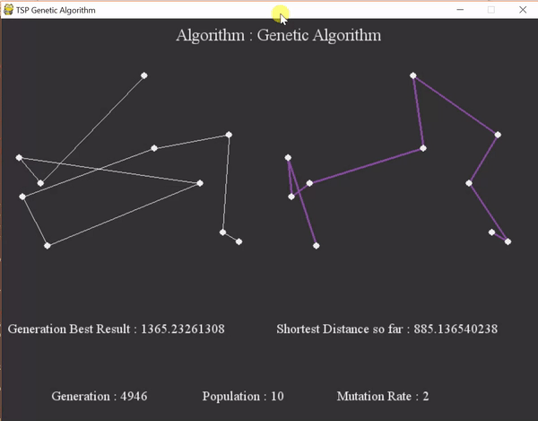

## Travelling Salesperson Problem

# Problem Statement

The travelling salesman problem (TSP) asks the following question: "Given a list of cities and the distances between each pair of cities, what is the shortest possible route that visits each city and returns to the origin city?" It is an NP-hard problem in combinatorial optimization, important in operations research and theoretical computer science.

The travelling purchaser problem and the vehicle routing problem are both generalizations of TSP.

In the theory of computational complexity, the decision version of the TSP (where, given a length L, the task is to decide whether the graph has any tour shorter than L) belongs to the class of NP-complete problems. Thus, it is possible that the worst-case running time for any algorithm for the TSP increases superpolynomially (but no more than exponentially) with the number of cities.

# The Solutions

To solve this problem, here are 3 proposed solutions:
  - Brute Force: Randomly generating any path and calculating the distance. Not a fast and ideal solution
  - Lexicographic Order: Checking all the possible routes possible. Good for small number of "cities".
  - Genetic Algorithm: Evolves the best and shortest route. Performs better than other algorithms, but with one limitation i.e., one cannot be sure if it is the best solution so far as we do not know the final result to compare with. There may be a chance of improvement!

# Usage

To create points, you can use "create points.py" to generate points, and then using different algorithms, one can find the shortest path and compare the results!
  
Here is a small demo of TSP in action using Genetic Algorithm

  

